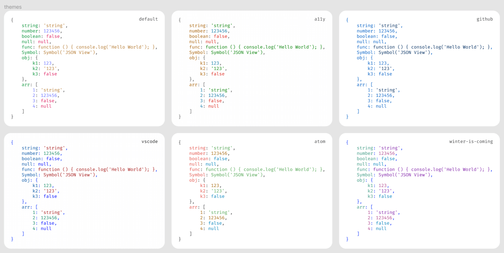

# React18 JSON View

<p >
  <a href="https://www.npmjs.com/package/react18-json-view" target="_blank">
    
  </a>
  <a href="https://www.npmjs.com/package/react18-json-view" target="_blank">
    
  </a>
    <a href="https://github.com/YYsuni/react18-json-view/blob/main/LICENSE" target="_blank">
    
  </a>
</p>

React function component for displaying javascript arrays and JSON objects. Supports all JS types.

[**Storybook**](https://react18-json-view.vercel.app/), or [**Try it online**](https://jv.yysuni.com/) [(**Github**)](https://github.com/YYsuni/json-view-online).


## Installation
```bash
npm i react18-json-view
```

## Usage
```tsx
import JsonView from 'react18-json-view'
import 'react18-json-view/src/style.css'
// If dark mode is needed, import `dark.css`.
// import 'react18-json-view/src/dark.css'

<JsonView src={my_json_object} />

// If needed, you can use the internal stringify function.
// import { stringify } from 'react18-json-view'

```

### Props
| Name                         | Type                | Default | Description                                                                                                                                                                                    |
| :--------------------------- | :------------------ | :------ | :--------------------------------------------------------------------------------------------------------------------------------------------------------------------------------------------- |
| `src`                        | `JSON Object`       | None    | This property contains your input JSON                                                                                                                                                         |
| `dark`                       | `boolean`           | false   | Keep in dark mode (Don't forget to import `dark.css`)                                                                                                                                                  |
| `theme`              | `default` \| `a11y` \| `github` \| `vscode` \| `atom`\|`winter-is-coming`     |'default'   | Color theme                                       |
| `collapseStringsAfterLength` | `integer`           | 99      | When an integer value is assigned, strings longer than that length will be truncated and indicated by an ellipsis. To expand or collapse the string content, simply click on the string value. |
| `collapseObjectsAfterLength` | `integer`           | 99      | When an integer value is assigned, the object and array will initially collapse.                                                                                                               |
| `collapsed`                  | `boolean` \| `integer` \| `function` | false   | When set to true(false), all nodes will be (not) collapsed by default. When using an integer value, it will collapse at a specific depth. The collapsed also can be a function.                                                                            |
| `enableClipboard`            | `boolean`           | true    | When `prop` is not `false`, users can copy objects and arrays to the clipboard by clicking on it.                                                                                              |
| `editable`                   | `boolean` \| {add?: `boolean`, edit?: `boolean`, delete?: `boolean`}           | false   | When set to true, you can add, edit, or delete the property, and the actions will trigger onAdd, onEdit, or onDelete. Options is available.                                                                         |
| `onAdd`                      | `function`          | -       | `(params: { indexOrName: string\| number, depth: number, src: any; parentType: 'object' \| 'array' }) => void`                                                                                 |
| `onDelete`                   | `function`          | -       | `(params:{ value: any,indexOrName: string \| number,depth: number,src: any,parentType: 'object' \| 'array'}) => void`                                                                          |
| `onEdit`                     | `function`          | -       | `(params: { newValue: any, oldValue: any, depth: number, src: any, indexOrName: string \| number, parentType: 'object' \| 'array'}) => void`                                                   |
| `customizeNode`    | `ReactElement`\|`ReactComponent`\|`Options`  | -       | Highly customize every node.                                              |

### Collapsed function
```ts
(params: {
    node: Record<string, any> | Array<any> // Object or array
    indexOrName: number | string | undefined
    depth: number
    size: number // Object's size or array's length
  }) => boolean
```
### Editable options
```ts
{
  add?: boolean
  edit?: boolean
  delete?: boolean
}
```
### CustomizeNode
```ts
(params: { node: any; indexOrName: number | string | undefined; depth: number }) =>
	| {
			add?: boolean
			edit?: boolean
			delete?: boolean
			enableClipboard?: boolean
			collapsed?: boolean
			className?: string
	  }
	| React.FC
	| typeof React.Component
	| React.ReactElement<any, any>
```

## Editable

### How to generate object/array

The editor uses `eval(<input-value>)`. While in edit mode, you can enter `({})` or `([])`, which will cause the result of eval to become a new object or array.

### How the editor works

This component does not perform any cloning operations, so every step of the operation is carried out on the original object. If cloning is required, please handle it yourself.

## Theme
Every theme has a dark mode. [preview](https://react18-json-view.vercel.app/?path=/docs/themes--docs)



## Custom themes

Below are the default theme variables that you can easily customize to fit your needs.

```css
.json-view {
	color: #4d4d4d;
	--json-property: #009033;
	--json-index: #676dff;
	--json-number: #676dff;
	--json-string: #b2762e;
	--json-boolean: #dc155e;
	--json-null: #dc155e;
}
.json-view .json-view--property { color: var(--json-property); }
.json-view .json-view--index { color: var(--json-index); }
.json-view .json-view--number { color: var(--json-number); }
.json-view .json-view--string { color: var(--json-string); }
.json-view .json-view--boolean { color: var(--json-boolean); }
.json-view .json-view--null { color: var(--json-null); }
```

## Why
react-json-view does not support React 18.

## Todo
- [x] copy (enableClipboard)
- [x] css
- [x] collapse at a particular depth (collapsed)
- [x] editable
  - [x] add
  - [x] edit
  - [x] delete
  - [x] onChange
  - [ ] onSelect
- [x] dark mode
- [ ] custom icon
- [ ] more usability/scenarios
- [ ] gif guide
- [x] more color themes(dark)
- [x] collapse objects callback
- [x] editable option
- [x] advance customization
- [ ] map/set viewer
- [ ] display data type
- [ ] display object size
- [ ] handle circle loop
- [x] redesign docs ★

* tree?