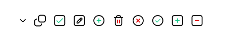

# React18 JSON View

<p >
  <a href="https://www.npmjs.com/package/react18-json-view" target="_blank">
    
  </a>
  <a href="https://www.npmjs.com/package/react18-json-view" target="_blank">
    
  </a>
    <a href="https://github.com/YYsuni/react18-json-view/blob/main/LICENSE" target="_blank">
    
  </a>
</p>

React function component for displaying javascript arrays and JSON objects. Supports all JS types.

[**Storybook**](https://react18-json-view.vercel.app/), or [**Try it online**](https://jv.yysuni.com/) [(**Github**)](https://github.com/YYsuni/json-view-online).


## Installation
```bash
npm i react18-json-view
# or pnpm i react18-json-view
# or yarn i react18-json-view

# canary
# or npm i react18-json-view@canary
# or pnpm i react18-json-view@canary
# or yarn i react18-json-view@canary
```

## Usage
```tsx
import JsonView from 'react18-json-view'
import 'react18-json-view/src/style.css'
// If dark mode is needed, import `dark.css`.
// import 'react18-json-view/src/dark.css'

<JsonView src={my_json_object} />

// If needed, you can use the internal stringify function.
import { stringify } from 'react18-json-view'

```

### Props
| Name                         | Type                | Default | Description                                                                                                                                                                                    |
| :--------------------------- | :------------------ | :------ | :--------------------------------------------------------------------------------------------------------------------------------------------------------------------------------------------- |
| `src`                        | `JSON Object`       | None    | This property contains your input JSON                                                                                                                                                         |
| `dark`                       | `boolean`           | false   | Keep in dark mode (Don't forget to import `dark.css`)                                                                                                                                                  |
| `collapseStringsAfterLength` | `integer`           | 99      | When an integer value is assigned, strings longer than that length will be truncated and indicated by an ellipsis. To expand or collapse the string content, simply click on the string value. |
| `collapseObjectsAfterLength` | `integer`           | 20      | When an integer value is assigned, the object and array will initially collapse.                                                                                                               |
| `enableClipboard`            | `boolean`           | true    | When `prop` is not `false`, users can copy objects and arrays to the clipboard by clicking on it.                                                                                              |
| `collapsed`                  | `boolean`/`integer` | false   | When set to true, all nodes will be collapsed by default. Use an integer value to collapse at a specific depth.                                                                                |
| `editable`                   | `boolean`           | false   | When set to true, you can add, edit, or delete the property, and the actions will trigger onAdd, onEdit, or onDelete.                                                                          |
| `onAdd`                      | `function`          | -       | `(params: { indexOrName: string\| number, depth: number, src: any; parentType: 'object' \| 'array' }) => void`                                                                                 |
| `onDelete`                   | `function`          | -       | `(params:{ value: any,indexOrName: string \| number,depth: number,src: any,parentType: 'object' \| 'array'}) => void`                                                                          |
| `onEdit`                     | `function`          | -       | `(params: { newValue: any, oldValue: any, depth: number, src: any, indexOrName: string \| number, parentType: 'object' \| 'array'}) => void`                                                   |

## Editable

### How to generate object/array

The editor uses `eval(<input-value>)`. While in edit mode, you can enter `({})` or `([])`, which will cause the result of eval to become a new object or array.

### How the editor works

This component does not perform any cloning operations, so every step of the operation is carried out on the original object. If cloning is required, please handle it yourself.

## Figma (icons) [link](https://www.figma.com/file/1XAkndYOprEcUZQU2KFFoT/Json-View?type=design&node-id=9%3A1570&mode=design&t=SQHDsbrSYStNeEOD-1)


## Custom styles
Here are all the style codes, you can freely change color variables, such as `--json-property`, or others.
```css
.json-view {
	display: block;
	--json-property: #009033;
	--json-index: #676dff;
	--json-number: #676dff;
	--json-string: #b2762e;
	--json-boolean: #dc155e;
	--json-null: #dc155e;
}
.json-view .json-view--property { color: var(--json-property); }
.json-view .json-view--index { color: var(--json-index); }
.json-view .json-view--number { color: var(--json-number); }
.json-view .json-view--string { color: var(--json-string); }
.json-view .json-view--boolean { color: var(--json-boolean); }
.json-view .json-view--null { color: var(--json-null); }

.json-view :is(.json-view--copy, .json-view--edit) {
	display: none;
	width: 1em;
	height: 1em;
	margin-left: 4px;
	cursor: pointer;
}

.json-view .json-view--deleting {
	outline: 1px solid #da0000;
	background-color: #da000011;
	text-decoration-line: line-through;
}
.json-view .json-view--input {
	width: 120px;
	margin-left: 4px;
	border-radius: 4px;
	border: 1px solid currentColor;
	padding: 0px 4px;
	font-size: 87.5%;
	line-height: 1.25;
	background: transparent;
}

:is(.json-view:hover, .json-view--pair:hover) > :is(.json-view--copy, .json-view--edit) {
	display: inline-block;
}

.json-view .jv-indent {
	padding-left: 16px;
}
.json-view .jv-chevron {
	display: inline-block;
	vertical-align: -20%;
	cursor: pointer;
	opacity: 0.4;
	width: 1em;
	height: 1em;
}
.json-view .jv-chevron:hover {
	opacity: 0.8;
}

.json-view .jv-button {
	background: transparent;
	outline: none;
	border: none;
	cursor: pointer;
}
.json-view .cursor-pointer {
	cursor: pointer;
}

```

### dark.css

```css
:is(.dark .json-view, .dark.json-view) {
	color: #ccc;
	--json-property: #009033;
	--json-index: #5d75f2;
	--json-number: #5d75f2;
	--json-string: #c57e29;
	--json-boolean: #e4407b;
	--json-null: #e4407b;
}

.dark :is(.json-view--copy, .json-view--edit) {
	color: #d1d1d1;
}

```

## Why
react-json-view does not support React 18.

## Todo
- [x] copy (enableClipboard)
- [x] css
- [x] collapse at a particular depth (collapsed)
- [x] editable
  - [x] add
  - [x] edit
  - [x] delete
  - [x] onChange
  - [ ] onSelect
- [x] dark mode
- [ ] custom icon

* tree?